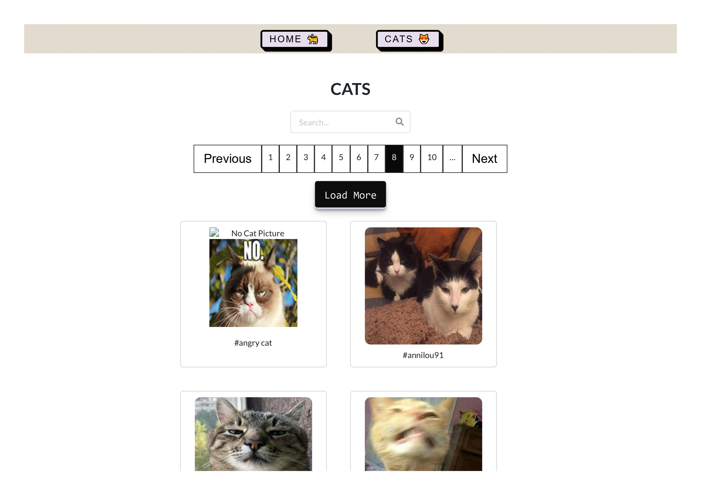
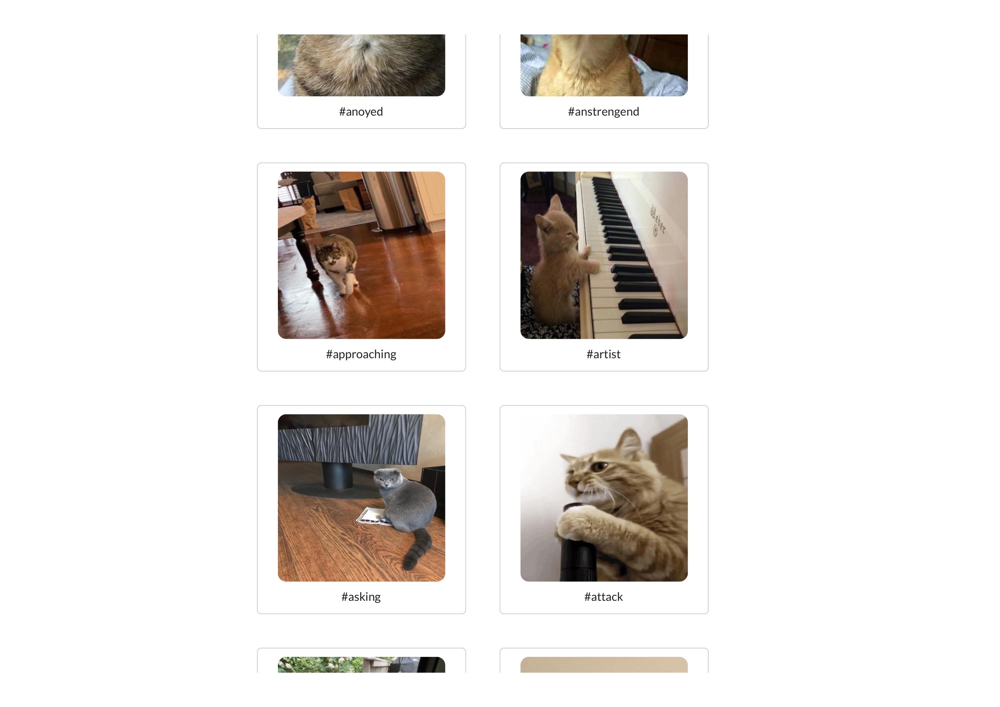
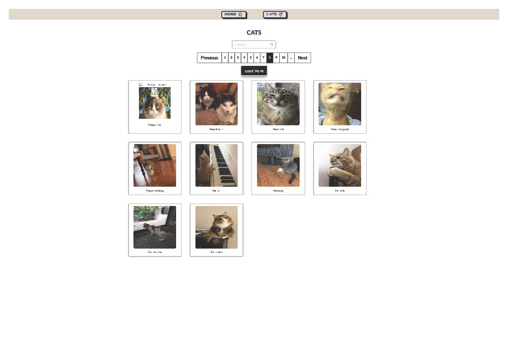

# CAT A A S project created with JavaScript, Express.js and Node.js

Fetching [cat as a service API](https://cataas.com)

## Available Scripts

In the project directory, you can run:

### `npm install`
### `npm run dev`

To run the app in the development mode.\
Open [http://localhost:5005](http://localhost:5005) to view it in your browser.

## Environmental variables

PORT </br>
ORIGIN >> Front-end url


## Other npm packages

```python
# Axios for API's requests
npm install axios

```

## Front-end  
 
Frontend repository --> [lodus-cat-client](https://github.com/Mog-Rouhi/ludus-cat-client)




